# poo-python-ev04

## Descripción

Evidencia de la actividad GA1-220501093-04-AA1-EV04 – Fundamentos de Python: Clases, Objetos y Encapsulación. Este repositorio reúne el reto integrador y los talleres de la actividad, todos programados en Python usando Programación Orientada a Objetos.

## Estructura del repositorio

poo-python-ev04/
├── README.md
├── capturas/
│   ├── reto_prestamos/
│   │   ├── agregar_equipo.png
│   │   ├── equipo_devuelto.png
│   │   ├── historial_prestamos.png
│   │   ├── main_menu.png
│   │   ├── menu_equipos.png
│   │   ├── prestamo_actualizado.png
│   │   ├── prestamo_registrado.png
│   │   └── prestamos_usuario.png
│   │
│   ├── taller_encapsulacion/
│   │   └── cuenta_bancaria.png
│   └── taller_clases_libros/
│       ├── libros_1.png
│       └── libros_2.png
├── taller_clases_objetos/
│   └── libro.py
├── taller_encapsulacion/
│   └── cuenta_bancaria.py
│   └── main.py
└── reto_prestamos/
    ├── equipo.py
    ├── usuario.py
    ├── prestamo.py
    ├── sistema.py
    └── main.py

## Diseño y encapsulación
### Reto: Sistema de préstamos de equipos

El reto está dividido en cuatro clases con una responsabilidad clara cada una:

Equipo: representa un equipo prestable. Su estado (disponible / prestado) es un atributo privado (__estado). Desde fuera solo se puede leer con la propiedad estado; la única forma de cambiarlo es con los métodos marcar_prestado() y marcar_disponible(), que validan la transición antes de aplicarla. Así se evita que cualquier parte del programa deje el equipo en un estado inconsistente.
Usuario: representa a la persona que solicita el préstamo, identificada por su documento.
Prestamo: relaciona un Equipo con un Usuario. Al crearse, llama automáticamente a equipo.marcar_prestado(), y al devolverse llama a marcar_disponible(). De esta manera la regla "un equipo prestado no puede volver a prestarse" se cumple siempre, sin depender de que quien use la clase se acuerde de aplicarla.
SistemaPrestamos: administra las colecciones (diccionario de equipos, diccionario de usuarios y lista de préstamos) y expone las operaciones: registrar, consultar, devolver, modificar y agregar equipos.

Decisión de diseño: la operación "modificar" cambia el responsable de un préstamo que sigue activo (modificar_prestamo). Un préstamo ya devuelto no se puede modificar.

### Taller de Clases y Objetos

La clase Libro usa atributos públicos (titulo, autor, paginas, disponible), ya que el objetivo de este taller es practicar la creación de clases, constructores y métodos, no la protección de datos. Los métodos prestar() y devolver() devuelven un mensaje de texto en lugar de imprimirlo directamente, y validan el estado actual antes de cambiarlo.

### Taller de Encapsulación

Aquí sí se aplica encapsulación explícita: _titular y _saldo son atributos protegidos por convención (un solo guion bajo). Se exponen mediante propiedades:

titular es de solo lectura (no tiene setter).
saldo tiene lectura y escritura, pero su setter lanza ValueError("El saldo no puede ser negativo") si se intenta asignar un valor negativo — incluso en el saldo inicial, porque el constructor asigna el saldo a través de esta misma propiedad.

Diferencia con el reto: en Equipo se usó doble guion bajo (__estado), que Python protege con name mangling, mientras que aquí se usó un solo guion bajo (_saldo), que es una convención de "no tocar desde fuera" pero no impide el acceso directo. Ambas formas son válidas; la elegida en cada caso depende de lo que pedía el enunciado.

## Cómo ejecutar
### Reto: Sistema de préstamos

cd reto_prestamos
python main.py

### Taller de Clases y Objetos — Libro

cd taller_clases_objetos
python libro.py

### Taller de Encapsulación — CuentaBancaria

cd taller_encapsulacion
python main.py

## Capturas de ejecución

-------------------------------CAPTURAS: RETO PRESTAMOS-------------------------------

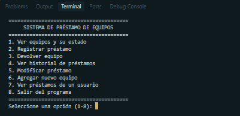

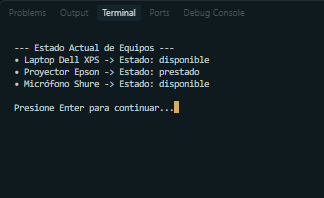

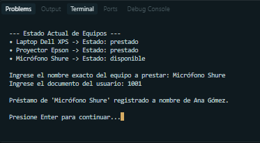

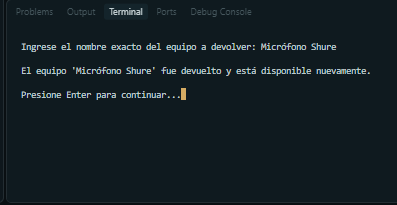

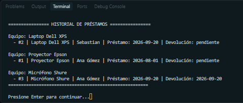

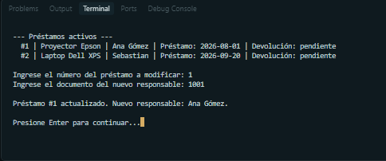

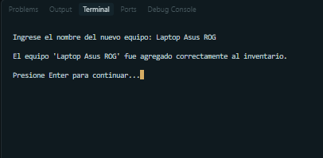

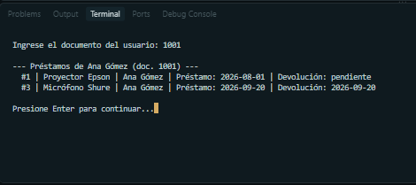

-------------------------------CAPTURA: TALLER ENCAPSULACION-------------------------------

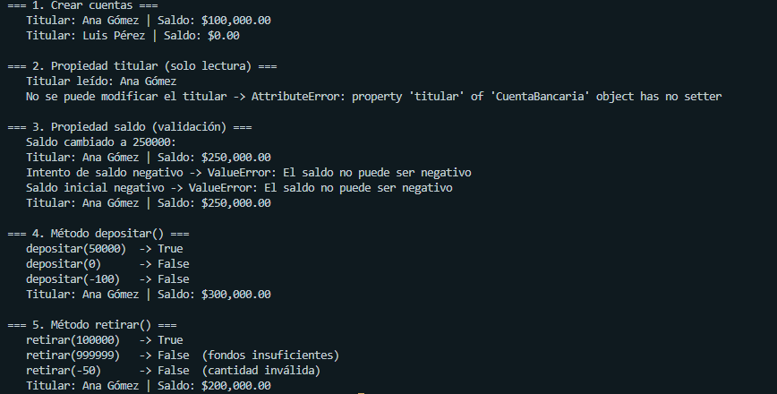

-------------------------------CAPTURAS: TALLER CLASES/LIBROS-------------------------------

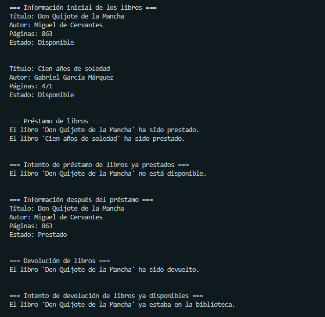

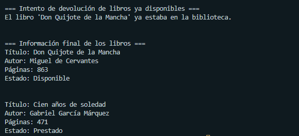